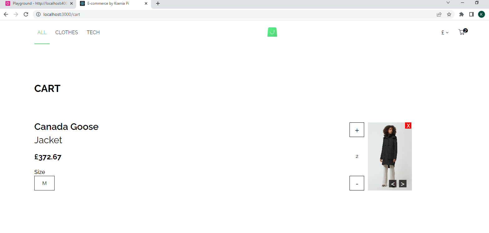
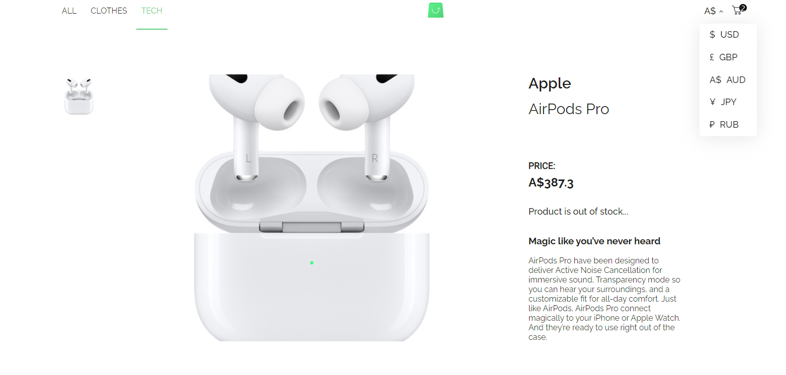

# E-commerce React app

Hey everyone! Here's my frontend solution of Scandiweb test task, here's a [design](https://www.figma.com/file/MSyCAqVy1UgNap0pvqH6H3/Junior-Frontend-Test-Designs-(Public)?node-id=0%3A1) and [endpoint](https://github.com/scandiweb/junior-react-endpoint).

## What did I use to do this task:

1. React Class components

2. Redux as state management library

3. React Router DOM for navigation

4. [Apollo](https://www.apollographql.com/docs/react/)

5. react-modal for modals

## How to start the project:

1. You will need firstly download or clone [endpoint](https://github.com/scandiweb/junior-react-endpoint)

2. Install dependencies - ***npm install / yarn***

3. Build the project - ***npm run build / yarn build***

4. Start the project - ***npm start / yarn start*** 

Now the backend part is ready on :4000 port and it's time to start frontend part

5. Download or clone this repo.

6. Install dependencies - ***npm install / yarn***

7. Build the project - ***npm run build / yarn build***

8. Start the project - ***npm start / yarn start*** 

It's ready now, hope you gonna enjoy it😃
